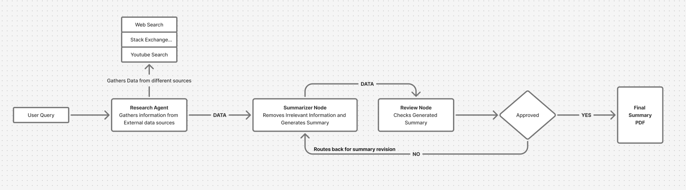
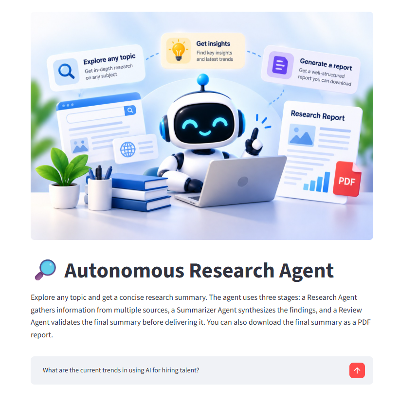
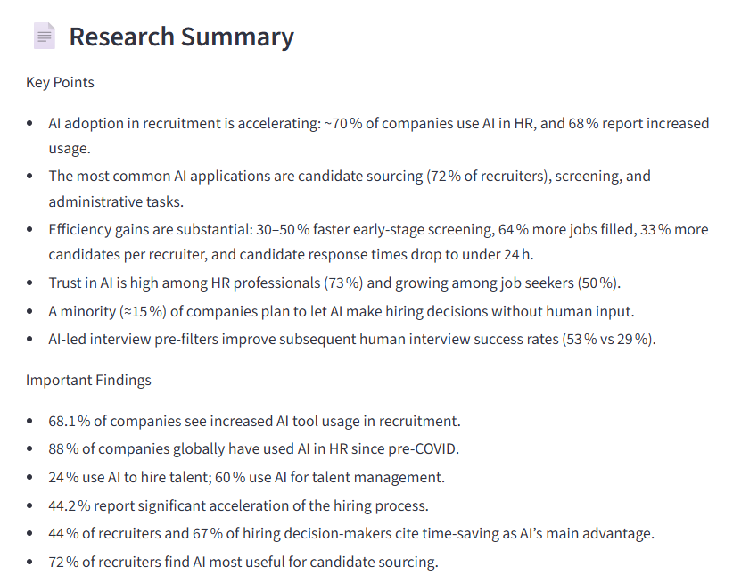
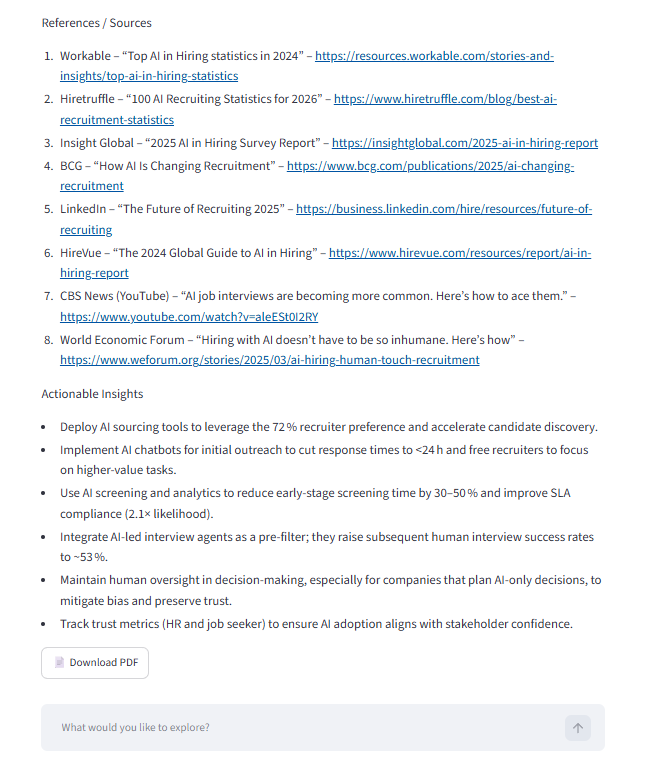
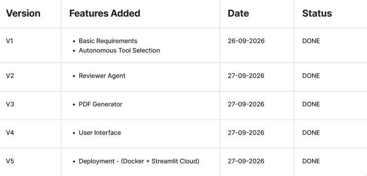

# 🔎 Autonomous Research Agent

An AI-powered research assistant that can take a topic, research it using multiple sources, summarize the findings, and review the final answer before showing it to the user.

The goal of this project was to build a practical autonomous workflow using LangGraph instead of making a single prompt chatbot.


## 2. Live Demo

[Try the application](https://autonomous-research-agent55.streamlit.app/) <br>

⚠️ **Note:** The live demo uses limited API credits. Please avoid sending multiple requests unnecessarily.


## 3. About the Project

Normally, researching a topic involves searching through different sources, going through the information, removing unnecessary content, and checking whether the final answer actually answers the question.

This project automates that process using a LangGraph workflow with one research agent and two LLM-powered nodes:

**Research Agent** – searches for relevant information using available tools.  
**Summarization Node** – combines the collected information into a concise summary.  
**Review Node** – checks whether the summary answers the user's query.

If the review fails, the workflow sends the summary back for revision instead of directly returning it.

The final summary can also be downloaded as a PDF.


## 4. App Architecture




## 5. Preview

### Preview 1



### Preview 2



### Preview 3




## 6. Development Journey




## 7. Technologies Used

- Python
- LangGraph
- LangChain
- Groq
- Tavily
- Stack Exchange
- YouTube Search
- Streamlit
- FPDF
- Docker


## 8. Installation Steps

1. Clone the repository.
2. Open the project folder.
3. Create and activate a virtual environment.
4. Install the dependencies from `requirements.txt`.
5. Create a `.env` file and add your `GROQ_API_KEY` and `TAVILY_API_KEY`.
6. Run the application:

```bash
streamlit run app.py
```
## 9. Docker (Optional)

The application can also be run using Docker.

Build the Docker image:

```bash
docker build -t autonomous-research-agent .
```
Run the Container
```
docker run -p 8501:8501 --env-file .env autonomous-research-agent
```

## 10. Project Structure

```text
Autonomous-Research-Agent/
│
├── assets/
│   ├── agent_image.png
│   ├── architecture.png
│   ├── development_journey.png
│   ├── final_preview_1.png
│   ├── final_preview_2.png
│   └── final_preview_3.png
│
├── app.py
├── graph.py
├── requirements.txt
├── Dockerfile
├── .dockerignore
├── .gitignore
└── README.md
